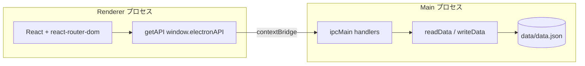

# MyTODO — アーキテクチャ概要

## 全体像

- **レンダラー**: `src/` — UI・ルーティングのみ。Node API は使わない
- **プリロード**: `electron/preload.ts` — `window.electronAPI` を公開
- **メイン**: `electron/main.ts` — ウィンドウ生成と IPC 実装
- **永続化**: `electron/store.ts` — JSON 読み書き

## ディレクトリ（主要）

| パス | 役割 |
|------|------|
| `src/App.tsx` | ルート定義 |
| `src/pages/` | 画面（Dashboard / TIL / Workout / Calendar / 予定 / 目標 / TODO） |
| `src/components/` | レイアウト・共有 UI（例: `ConfirmDialog`） |
| `electron/main.ts` | BrowserWindow、各 `ipcMain.handle` |
| `electron/preload.ts` | `electronAPI` 公開 |
| `electron/store.ts` | データ型、`data/data.json` パス・読み書き |
| `vite.config.ts` | React + `vite-plugin-electron/simple`（main / preload ビルド） |

## データモデル（概念）

- **Goal / TIL / Workout / Task**: 日付またはメタ情報で関連
- **予定（EnjoymentEvent）**: `date` は任意。日付なしはカレンダー集計から除外され一覧のみ表示
- **ゲーミフィケーション**: `DataFile.gamification`（累計 EXP、ストリーク）と `xpLedger`（週次集計・表示用の直近ログ）。レベルと特典内容は `electron/gamification.ts` の定数から **累計 EXP から算出** する

## IPC 命名

チャネル名は実装上 `goals:list` のような `カテゴリ:アクション` がプリロードと対になっている。新規追加時は **main / preload / `vite-env.d.ts` の3箇所** を必ず更新する。

## ビルド出力

- フロント: `dist/`
- Electron: `dist-electron/`（`main.js`, `preload.mjs` 等）
- インストーラ: `electron-builder` 設定により `release/`

## 関連ドキュメント

- 運用ルール: [instructions.md](instructions.md)
